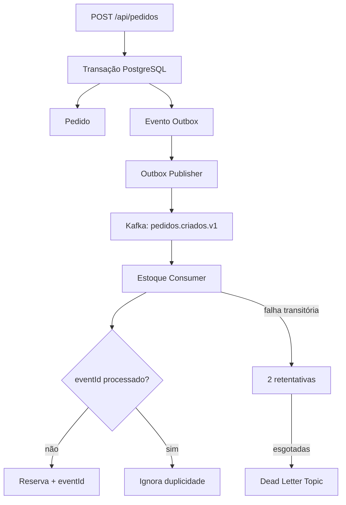

# Arquitetura e decisões técnicas

## Fluxo principal



## Garantias e limites

- O banco do pedido contém tanto a regra de negócio quanto o evento a publicar.
- O publicador pode publicar novamente caso falhe entre o envio e a marcação do Outbox. Por isso o consumidor é idempotente.
- A chave `pedidoId` direciona eventos do mesmo pedido à mesma partição.
- O grupo `estoque-service-v1` divide as três partições entre instâncias do serviço.
- A solução adota entrega pelo menos uma vez; não promete "exactly once" de ponta a ponta.

## Estrutura

```text
logiflow/
├── docker-compose.yml
├── pedido-service/
│   ├── domain, application, api, event, outbox
│   └── migrations Flyway
├── estoque-service/
│   ├── domain, api, event, kafka
│   └── migrations Flyway
└── painel-web/
    └── React + Vite + Nginx
```

## Exercícios sugeridos

1. Force uma exceção transitória no consumidor e observe as tentativas.
2. Envie um evento sem itens e encontre-o na DLT.
3. Suba duas instâncias do estoque e observe a atribuição das partições.
4. Adicione `expedicao-service` consumindo `EstoqueReservadoEvent`.
5. Implemente um endpoint administrativo para reprocessamento seguro da DLT.
