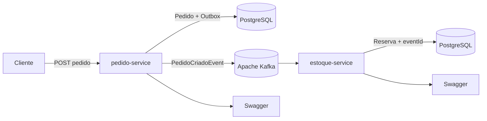

# LogiFlow — Event-Driven Logistics

[](https://openjdk.org/)
[](https://spring.io/projects/spring-boot)
[](https://kafka.apache.org/)
[](https://www.postgresql.org/)
[](https://www.docker.com/)
[](LICENSE)

Plataforma de logística distribuída que recebe pedidos, publica eventos de forma confiável e reserva estoque de maneira assíncrona. O projeto demonstra como lidar com problemas reais de sistemas orientados a eventos: **dual write**, mensagens duplicadas, falhas transitórias e mensagens não processáveis.

> Projeto de portfólio desenvolvido por **Jucelio Farias Coelho**, com foco em uma posição de Desenvolvedor Java Backend.

[Visão geral](#visão-geral) · [Arquitetura](#arquitetura) · [Como executar](#como-executar) · [Testar a API](#testar-a-api) · [Evidências](#evidências-de-qualidade) · [Decisões técnicas](#decisões-técnicas)

---

## Visão geral

Uma chamada REST cria um pedido no `pedido-service`. Pedido e evento são persistidos na **mesma transação** por meio do padrão Transactional Outbox. Em seguida, o evento é publicado no Apache Kafka e consumido pelo `estoque-service`, que cria a reserva sem acoplamento direto entre os serviços.

### O que este projeto comprova

| Competência | Implementação no LogiFlow |
|---|---|
| Java moderno | Java 21 e Spring Boot 3.5.4 |
| Microsserviços | Serviços de pedidos e estoque com bancos independentes |
| Event-driven | Comunicação assíncrona via Apache Kafka |
| Consistência | Transactional Outbox evita pedido salvo sem evento persistido |
| Confiabilidade | Entrega `at-least-once`, idempotência por `eventId`, retries e DLT |
| Persistência | PostgreSQL por serviço e migrations versionadas com Flyway |
| APIs | REST, Bean Validation e documentação Swagger/OpenAPI |
| Infraestrutura | Ambiente reproduzível com Docker Compose e health checks |
| Frontend | Painel React/Vite servido por Nginx |
| Qualidade | Testes automatizados e validação manual do fluxo completo |

## Arquitetura




### Fluxo principal

1. O cliente envia `POST /api/pedidos`.
2. O `pedido-service` grava o pedido e o registro da Outbox na mesma transação.
3. O Outbox Publisher envia `PedidoCriadoEvent` ao tópico `logiflow.pedidos.criados.v1`.
4. O `pedidoId` é usado como chave Kafka, preservando a ordem relativa dos eventos do pedido.
5. O `estoque-service` verifica o `eventId` antes de processar a mensagem.
6. Se o evento for novo, a reserva e o identificador processado são persistidos.
7. Falhas transitórias passam por duas retentativas.
8. Após o esgotamento das tentativas, a mensagem segue para `logiflow.pedidos.criados.v1.DLT`.

### Componentes

| Componente | Responsabilidade | Porta |
|---|---|---:|
| `pedido-service` | Criar/consultar pedidos e publicar eventos via Outbox | 8081 |
| `estoque-service` | Consumir eventos, garantir idempotência e reservar estoque | 8082 |
| `painel-web` | Visualizar pedidos e reservas | 3000 |
| Apache Kafka | Broker de eventos em modo KRaft | 9092 |
| Kafka UI | Inspecionar tópicos, partições e mensagens | 8090 |
| PostgreSQL — pedidos | Banco exclusivo do serviço de pedidos | 5435 |
| PostgreSQL — estoque | Banco exclusivo do serviço de estoque | 5436 |

Mais detalhes e garantias estão em [ARQUITETURA.md](ARQUITETURA.md).

## Principais funcionalidades

- Criação e consulta de pedidos via API REST;
- persistência atômica de pedido e evento com Transactional Outbox;
- publicação e consumo assíncrono no Kafka;
- reserva automática de estoque;
- consumidor idempotente por `eventId`;
- retries para falhas transitórias;
- Dead Letter Topic para mensagens não processáveis;
- migrations de banco com Flyway;
- painel web para acompanhamento do fluxo;
- Swagger/OpenAPI nos dois serviços;
- ambiente completo iniciado com um único comando.

## Stack

| Camada | Tecnologias |
|---|---|
| Backend | Java 21, Spring Boot 3.5.4, Spring Web, Spring Data JPA, Spring Kafka |
| Dados | PostgreSQL 16, Flyway |
| Mensageria | Apache Kafka 3.9.1, Transactional Outbox, DLT |
| Testes | JUnit, Spring Boot Test |
| Frontend | React, Vite, Lucide React, Nginx |
| Infraestrutura | Docker, Docker Compose, Kafka UI |
| Documentação | Swagger/OpenAPI, Mermaid |

## Como executar

### Pré-requisitos

- Git;
- Docker Desktop com Docker Compose.

### Inicialização rápida

```bash
git clone https://github.com/juceliocoelho2022/logiflow-event-driven-logistics.git
cd logiflow-event-driven-logistics
docker compose up --build -d
```

Aguarde os health checks e confirme o ambiente:

```bash
docker compose ps
```

### Acessos locais

| Recurso | URL |
|---|---|
| Painel web | http://localhost:3000 |
| Swagger — Pedidos | http://localhost:8081/swagger-ui.html |
| Swagger — Estoque | http://localhost:8082/swagger-ui.html |
| Kafka UI | http://localhost:8090 |

Para encerrar:

```bash
docker compose down
```

Para remover também os volumes locais:

```bash
docker compose down -v
```

## Testar a API

### 1. Criar um pedido

```bash
curl -X POST http://localhost:8081/api/pedidos \
  -H "Content-Type: application/json" \
  -d '{
    "clienteId": "11111111-1111-1111-1111-111111111111",
    "itens": [
      {
        "produtoId": "SKU-001",
        "quantidade": 2,
        "precoUnitario": 49.90
      }
    ]
  }'
```

### 2. Consultar pedidos

```bash
curl http://localhost:8081/api/pedidos
```

### 3. Consultar reservas

```bash
curl http://localhost:8082/api/reservas
```

O resultado esperado é um pedido com status `CRIADO` e uma reserva com status `RESERVADO`. O evento pode ser acompanhado pelo Kafka UI e o fluxo também aparece no painel web.

## Evidências de qualidade

### Testes automatizados

```bash
cd pedido-service
mvn test
```

### Cenários validados

| Cenário | Evidência esperada | Status |
|---|---|---:|
| Criação de pedido | Pedido persistido com status `CRIADO` | ✅ |
| Transactional Outbox | Pedido e evento salvos na mesma transação | ✅ |
| Publicação Kafka | Evento no tópico principal | ✅ |
| Consumo | Evento recebido pelo serviço de estoque | ✅ |
| Reserva | Reserva criada com status `RESERVADO` | ✅ |
| Idempotência | Evento repetido não cria segunda reserva | ✅ |
| Retentativas | Falha transitória aciona novas tentativas | ✅ |
| DLT | Mensagem inválida é preservada no tópico de erro | ✅ |

### Garantias e limites

- O sistema adota entrega **pelo menos uma vez** (`at-least-once`).
- O publicador pode reenviar um evento se falhar entre a publicação e a atualização da Outbox; por isso, o consumidor é idempotente.
- O projeto não promete “exactly once” de ponta a ponta.
- O processamento mantém a ordem relativa dos eventos do mesmo pedido por meio da chave `pedidoId`.

Esses limites são intencionais e documentam o trade-off arquitetural — arquitetura séria também diz o que **não** garante.

## Decisões técnicas

| Decisão | Motivo |
|---|---|
| Banco por serviço | Reduz acoplamento de dados entre os microsserviços |
| Transactional Outbox | Evita o problema de dual write entre PostgreSQL e Kafka |
| Contrato de evento próprio | Não expõe diretamente entidades JPA na mensageria |
| `pedidoId` como chave | Mantém eventos do mesmo pedido na mesma partição |
| Idempotência por `eventId` | Torna seguro o reprocessamento de mensagens duplicadas |
| Retry + DLT | Separa falhas transitórias de mensagens que exigem análise |
| Flyway | Mantém o schema reproduzível e versionado |
| Docker Compose | Permite avaliação local rápida e consistente |

## Estrutura do repositório

```text
logiflow-event-driven-logistics/
├── pedido-service/       # API de pedidos e Transactional Outbox
├── estoque-service/      # Consumer Kafka, idempotência e reservas
├── painel-web/           # React + Vite + Nginx
├── docs/images/          # Diagrama de arquitetura
├── docker-compose.yml    # Ambiente local completo
├── ARQUITETURA.md        # Decisões e garantias técnicas
└── README.md
```

## Roadmap

- [ ] Serviço de expedição e rastreamento;
- [ ] autenticação JWT e autorização por perfis;
- [ ] reprocessamento seguro da DLT;
- [ ] métricas com Prometheus e Grafana;
- [ ] tracing distribuído;
- [ ] testes de integração com Testcontainers;
- [ ] Schema Registry e evolução de contratos;
- [ ] pipeline de CI/CD com GitHub Actions.

## Autor

**Jucelio Farias Coelho**  
Professor técnico em Desenvolvimento de Sistemas e Desenvolvedor Java Backend.

[LinkedIn](https://www.linkedin.com/in/jucelio-desenvolvedor-sistema) · [GitHub](https://github.com/juceliocoelho2022)

## Licença

Distribuído sob a licença MIT. Consulte [LICENSE](LICENSE).
