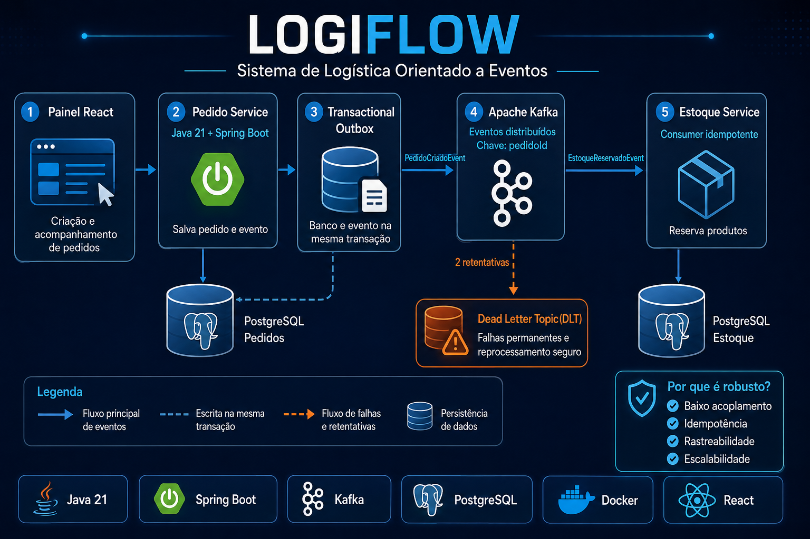

# LogiFlow

Sistema de logística orientado a eventos desenvolvido para portfólio, utilizando Java 21, Spring Boot, PostgreSQL, Apache Kafka, Docker e React.

O projeto demonstra comunicação assíncrona entre microsserviços, consistência transacional com o padrão Transactional Outbox, processamento idempotente de eventos e tratamento de falhas com Dead Letter Topic.

## Funcionalidades

* Criação e consulta de pedidos;
* persistência transacional de pedidos e eventos;
* publicação assíncrona de eventos no Apache Kafka;
* reserva automática de estoque;
* processamento idempotente por `eventId`;
* retentativas para falhas transitórias;
* encaminhamento de mensagens com falha para DLT;
* painel web para acompanhamento das operações;
* documentação das APIs com Swagger/OpenAPI;
* inicialização completa do ambiente com Docker Compose.

## Arquitetura da Sprint 1

1. O `pedido-service` recebe uma requisição em `POST /api/pedidos`.
2. O pedido e seu evento Outbox são gravados na mesma transação no PostgreSQL.
3. O publicador Outbox envia o evento pendente para o tópico `logiflow.pedidos.criados.v1`.
4. O `pedidoId` é utilizado como chave Kafka para preservar a ordem relativa dos eventos.
5. O `estoque-service` consome o evento e verifica sua duplicidade por `eventId`.
6. Uma reserva de estoque é registrada quando o evento ainda não foi processado.
7. Falhas transitórias passam pelas retentativas configuradas.
8. Depois das tentativas, a mensagem com falha é encaminhada para `logiflow.pedidos.criados.v1.DLT`.

```text
Cliente
   │
   ▼
pedido-service
   │
   ├── PostgreSQL: Pedido + Outbox
   │
   ▼
Apache Kafka
   │
   ▼
estoque-service
   │
   ├── Controle de idempotência
   ├── Reserva de estoque
   └── Retentativas e DLT
```



## Tecnologias

### Backend

* Java 21;
* Spring Boot;
* Spring Web;
* Spring Data JPA;
* Spring for Apache Kafka;
* Bean Validation;
* Flyway;
* Maven;
* JUnit;
* Mockito.

### Dados e mensageria

* PostgreSQL;
* Apache Kafka;
* Transactional Outbox;
* Dead Letter Topic;
* processamento idempotente.

### Frontend e infraestrutura

* React;
* Docker;
* Docker Compose;
* Nginx;
* Kafka UI;
* Swagger/OpenAPI.

## Estrutura do projeto

```text
logiflow-event-driven-logistics/
├── pedido-service/
│   ├── src/main/java/
│   ├── src/main/resources/
│   ├── src/test/
│   ├── Dockerfile
│   └── pom.xml
├── estoque-service/
│   ├── src/main/java/
│   ├── src/main/resources/
│   ├── Dockerfile
│   └── pom.xml
├── painel-web/
│   ├── src/
│   ├── Dockerfile
│   ├── nginx.conf
│   └── package.json
├── docs/
│   └── images/
│       └── logiflow-arquitetura.png
├── docker-compose.yml
├── ARQUITETURA.md
├── LICENSE
└── README.md
```

## Requisitos

Para executar o ambiente completo:

* Docker Desktop;
* Docker Compose.

Para desenvolvimento fora do Docker:

* Java 21;
* Maven 3.9 ou superior;
* Node.js 20 ou superior;
* PostgreSQL;
* Apache Kafka.

## Executando o projeto

Clone o repositório:

```bash
git clone https://github.com/juceliocoelho2022/logiflow-event-driven-logistics.git
cd logiflow-event-driven-logistics
```

Suba todos os serviços:

```bash
docker compose up --build
```

Para executar em segundo plano:

```bash
docker compose up --build -d
```

Confira os containers:

```bash
docker compose ps
```

Para encerrar o ambiente:

```bash
docker compose down
```

## Acessos

| Serviço           | Endereço                              |
| ----------------- | ------------------------------------- |
| Painel web        | http://localhost:3000                 |
| Swagger — Pedidos | http://localhost:8081/swagger-ui.html |
| Swagger — Estoque | http://localhost:8082/swagger-ui.html |
| Kafka UI          | http://localhost:8090                 |

## Criando um pedido

```bash
curl -X POST http://localhost:8081/api/pedidos \
  -H "Content-Type: application/json" \
  -d '{
    "clienteId": "11111111-1111-1111-1111-111111111111",
    "itens": [
      {
        "produtoId": "SKU-001",
        "quantidade": 2,
        "precoUnitario": 49.90
      }
    ]
  }'
```

## Consultando pedidos e reservas

Consultar pedidos:

```bash
curl http://localhost:8081/api/pedidos
```

Consultar reservas:

```bash
curl http://localhost:8082/api/reservas
```

Os resultados também podem ser acompanhados pelo painel web.

## Testes automatizados

Execute os testes do serviço de pedidos:

```bash
cd pedido-service
mvn test
```

Os testes verificam as regras da camada de aplicação e o comportamento esperado durante a criação dos pedidos.

## Validação da Sprint 1

A Sprint 1 foi validada por meio de testes manuais do fluxo completo orientado a eventos.

### Fluxo principal

```text
Pedido → Transactional Outbox → Apache Kafka → Estoque → Reserva
```

Resultados verificados:

* pedido criado com status `CRIADO`;
* evento persistido na Outbox;
* evento publicado no tópico `logiflow.pedidos.criados.v1`;
* mensagem consumida pelo `estoque-service`;
* reserva criada com status `RESERVADO`;
* dados disponibilizados pelo painel e pelas APIs.

### Teste de idempotência

O mesmo evento foi republicado mantendo o mesmo `eventId`.

Resultados:

* o Kafka recebeu duas mensagens com o mesmo `eventId`;
* o consumidor identificou a duplicidade;
* apenas uma reserva permaneceu registrada;
* o log apresentou a mensagem `Evento duplicado ignorado`.

Isso comprova que entregas repetidas não geram reservas duplicadas.

### Teste da Dead Letter Topic

Uma mensagem inválida foi publicada de maneira controlada no tópico principal.

Resultados:

* o processamento da mensagem falhou;
* as retentativas configuradas foram executadas;
* a mensagem foi encaminhada para `logiflow.pedidos.criados.v1.DLT`;
* o conteúdo original foi preservado;
* nenhuma reserva inválida foi criada;
* a quantidade de reservas permaneceu em `1`.

### Evidências dos testes

| Teste                                 | Resultado  |
| ------------------------------------- | ---------- |
| Criação de pedido                     | ✅ Aprovado |
| Persistência via Transactional Outbox | ✅ Aprovado |
| Publicação no Apache Kafka            | ✅ Aprovado |
| Consumo pelo serviço de estoque       | ✅ Aprovado |
| Reserva automática                    | ✅ Aprovado |
| Idempotência por `eventId`            | ✅ Aprovado |
| Retentativas de processamento         | ✅ Aprovado |
| Encaminhamento para DLT               | ✅ Aprovado |
| Consistência do estoque               | ✅ Aprovado |

## Decisões arquiteturais

* O evento possui contrato próprio e não reutiliza diretamente uma entidade JPA;
* o padrão Transactional Outbox reduz o risco de salvar um pedido sem persistir seu evento;
* o `pedidoId` é utilizado como chave Kafka para preservar a ordem relativa dos eventos;
* o `eventId` possui unicidade no consumidor para impedir processamentos duplicados;
* o offset é confirmado somente após a conclusão da transação do consumidor;
* falhas transitórias passam por retentativas antes do envio para a DLT;
* a DLT possui listener e registro de logs para análise das falhas;
* as migrations do banco de dados são controladas pelo Flyway.

Mais detalhes estão disponíveis em [ARQUITETURA.md](ARQUITETURA.md).

## Próximas sprints

* [ ] Implementar expedição e rastreamento de entregas;
* [ ] adicionar autenticação JWT e controle de perfis;
* [ ] criar reprocessamento seguro de mensagens da DLT;
* [ ] adicionar métricas com Prometheus e Grafana;
* [ ] implementar tracing distribuído;
* [ ] criar testes de integração com Testcontainers;
* [ ] adicionar Schema Registry e evolução de contratos;
* [ ] configurar pipeline de CI/CD com GitHub Actions.

## Autor

**Jucelio Farias Coelho**

Professor técnico em Desenvolvimento de Sistemas e desenvolvedor Java Backend em transição profissional.

* [LinkedIn](https://www.linkedin.com/in/jucelio-desenvolvedor-sistema)
* [GitHub](https://github.com/juceliocoelho2022)

## Licença

Este projeto está licenciado sob a licença MIT. Consulte o arquivo [LICENSE](LICENSE) para mais informações.
